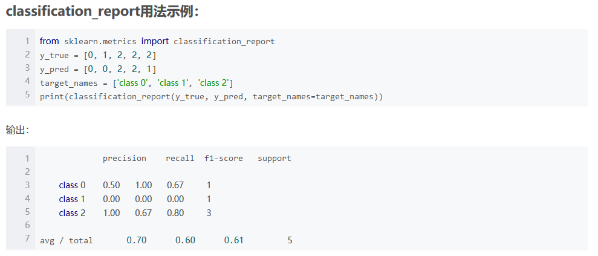
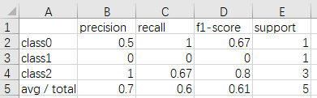

# API
旨在根据现有的功能，打造一套属于自己的封装工具，方便今后。

## 1. utility
### 1.1 计算精度/召回/F1并将其存储  
  
这个方法有一个弊端就是最后的输出是字符串，当遇到类别特别多的情况下，终端不能很友好的显示。现在将其封装，将运行结果友好的在CSV文件中进行展示。
```
F1toCsv(y_true, y_pred, class_name, filepath)
```
`y_true`：真实标签  
`y_pred`：预测值  
`class_name`：类别名列表（注意类别名内部不能有空格）  
`filepath`：存储路径  
**Usage**
```
y_true = [0, 1, 2, 2, 2] 
y_pred = [0, 0, 2, 2, 1] 
target_names = ['class0', 'class1', 'class2'] 

F1toCsv(y_true, y_pred, target_names, "result.csv")
```
**结果**  
  
